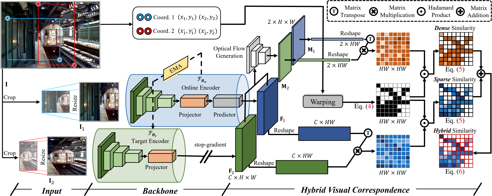
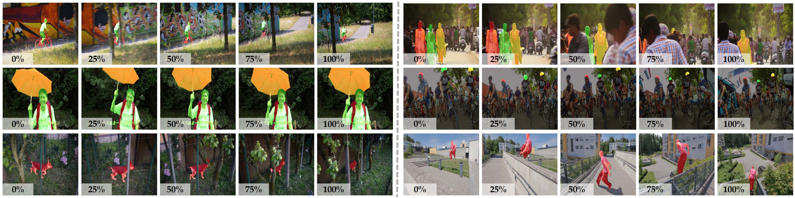
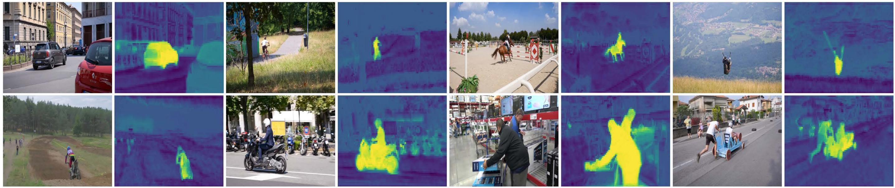
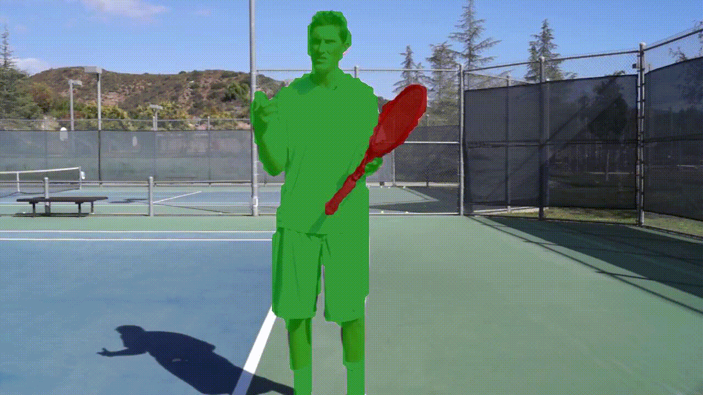
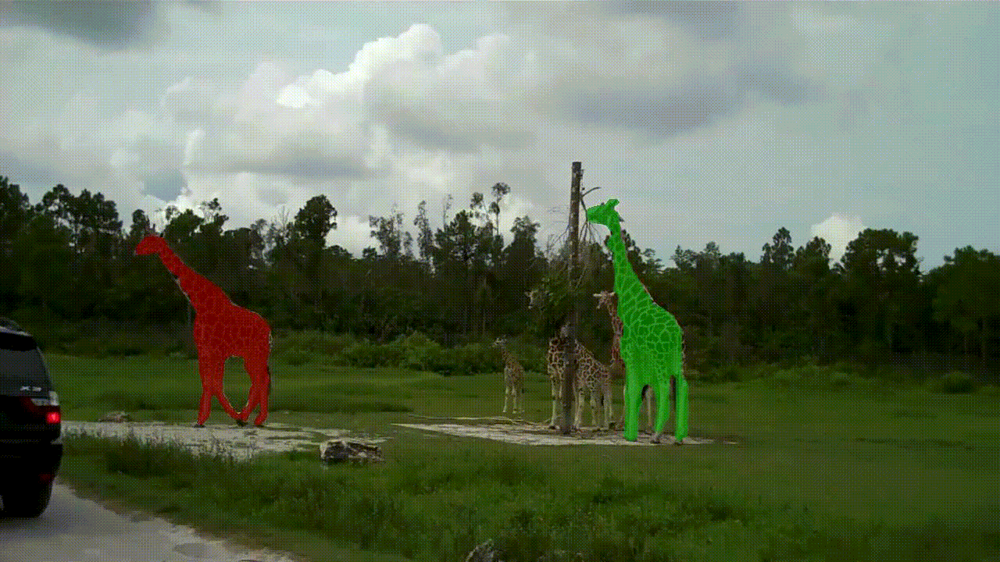

#  HVC (Hybrid Visual Correspondence for Video Object Segmentation)


>This repository is the official PyTorch implementation of the anonymous paper: **Hybrid Visual Correspondence for Video Object Segmentation**

>HVC is a simple yet practical self-supervised method for video segmentation on unlabeled videos.

><center>The architeture of HVC.</center>

VOS benchmark examples:
>
><center>Qualitative results of HVC.</center>

>
><center>Heat Maps from HVC without any supervision.</center>

## Highlights
- **Performance:** HVC achieves SOTA self-supervised results on VOS benchmarks (DAVIS17 val-set: **73.1**, YouTube-VOS 2018 val-set: **71.6**, DAVIS16 val-set: **80.1**, DAVIS17 dev-set: **61.8**, and YouTube-VOS 2019 val-set: **71.3**). 
- **Efficiency:** HVC reaches SOTA performance with the same training data by leveraging less training time (**7h**) and GPU memory (**16GB**).
- **Robustness**: HVC enables the same self-supervised VOS performance with static image datasets ([MSRA10k](https://mmcheng.net/msra10k/): **71.1**, [PASCAL VOC](http://host.robots.ox.ac.uk/pascal/VOC/): **72.0**, and [COCO](https://cocodataset.org/): **73.1**) as with the video dataset (e.g. YouTube-VOS).

## Requirements
- python 3.9
- torch==1.12.1 
- torchvision==0.13.1
- CUDA 11.3

Create a conda envvironment:
```bash
conda create -n hvc python=3.9 -y
conda activate hvc
pip install torch==1.12.1+cu113 torchvision==0.13.1+cu113 --extra-index-url https://download.pytorch.org/whl/cu113
```

## Model Zoo and Results
| Model                           | Socre ↑   |  Download                |
| :-----------------------------: | :-------: | :----------------------: |
| HVC pre-trained on YouTube-VOS  |  DAVIS17 val-set: 73.1  |  [model](https://github.com/Anonymous-SSVOS/HVC/releases/download/v0.1/releases_models.zip) / [results](https://github.com/Anonymous-SSVOS/HVC/releases/download/v0.1/hvc_ytb.zip) |
| HVC pre-trained on COCO         |  DAVIS17 val-set: 73.1  |  [model](https://github.com/Anonymous-SSVOS/HVC/releases/download/v0.1/releases_models.zip) / [results](https://github.com/Anonymous-SSVOS/HVC/releases/download/v0.1/hvc_coco.zip) |
| HVC pre-trained on PASCAL VOC   |  DAVIS17 val-set: 72.0  |  [model](https://github.com/Anonymous-SSVOS/HVC/releases/download/v0.1/releases_models.zip) / [results](https://github.com/Anonymous-SSVOS/HVC/releases/download/v0.1/hvc_voc.zip) |
| HVC pre-trained on MSRA10k      |  DAVIS17 val-set: 71.1  |  [model](https://github.com/Anonymous-SSVOS/HVC/releases/download/v0.1/releases_models.zip) / [results](https://github.com/Anonymous-SSVOS/HVC/releases/download/v0.1/hvc_msra.zip) |

``Note:`` HVC requires only one training session to infer all test datasets for VOS.

## Dataset Preparation
1. Download the DAVIS 2017 val-set from the [DAVIS website](https://davischallenge.org/), the direct download [link](https://data.vision.ee.ethz.ch/csergi/share/davis/DAVIS-2017-trainval-480p.zip).
2. Download the full YouTube-VOS dataset (version 2018) from the [YouTube-VOS website](https://youtube-vos.org/dataset/vos/), the direct download [link](https://drive.google.com/drive/folders/1bI5J1H3mxsIGo7Kp-pPZU8i6rnykOw7f?usp=sharing). Please move ``ytvos.csv`` from ``data/`` to the path ``data/YTB/2018/train_all_frames``.
3. Please ensure the datasets are organized as following format.
```
data
  |--filelists
  |--DAVIS
      |--Annotations
      |--ImageSets
      |--JPEGImages
  |--YTB
      |--2018
           |--train_all_frames
                   |--ytvos.csv
           |--valid_all_frames
```
``Note:`` Please prepare the following datasets if you want to test the DAVIS dev-set and YouTube-VOS val-set (2019 version).

Download link: [DAVIS dev-set](https://data.vision.ee.ethz.ch/csergi/share/davis/DAVIS-2017-test-dev-480p.zip), [YTB 2019 val-set](https://drive.google.com/drive/folders/1BWzrCWyPEmBEKm0lOHe5KLuBuQxUSwqz?usp=sharing).

## Training
```bash
# pre-train on YouTube-VOS
bash ./scripts/run_train.sh
```

## Testing
- Download [MoCo V1](https://dl.fbaipublicfiles.com/moco/moco_checkpoints/moco_v1_200ep/moco_v1_200ep_pretrain.pth.tar), and put it in the folder ``checkpoints/``.
- Download [HVC](https://github.com/Anonymous-SSVOS/HVC/releases/download/v0.1/releases_models.zip) and unzip them into the folder ``checkpoints/``.
```bash
# DAVIS 17 val-set
bash ./scripts/run_test.sh hvc davis17
bash ./scripts/run_metrics hvc davis17
```
```bash
# YouTube-VOS val-set
bash ./scripts/run_test.sh hvc ytvos
# Please use the official YouTube-VOS server to calculate scores.
```
```bash
# DAVIS 17 dev-set
bash ./scripts/run_test.sh hvc davis17dev
# Please use the official DAVIS server to calculate scores.
```
``Note:`` YouTube-VOS servers ([2018 server](https://codalab.lisn.upsaclay.fr/competitions/7685) and [2019 server](https://codalab.lisn.upsaclay.fr/competitions/6066)); DAVIS server ([2017 dev-set](https://codalab.lisn.upsaclay.fr/competitions/6812)).

## Results

<center>DAVIS 2017 val-set</center>

 | 
---|---

<center>YouTube-VOS val-set</center>

 | 
---|---

<center>DAVIS 2017 dev-set</center>

 | 
---|---


## Acknowledgements
- We thank [PyTorch](https://pytorch.org/), [YouTube-VOS](https://youtube-vos.org/), and [DAVIS](https://davischallenge.org/) contributors.

- Thanks to [videowalk](https://github.com/ajabri/videowalk) for the label propagation codebases.
